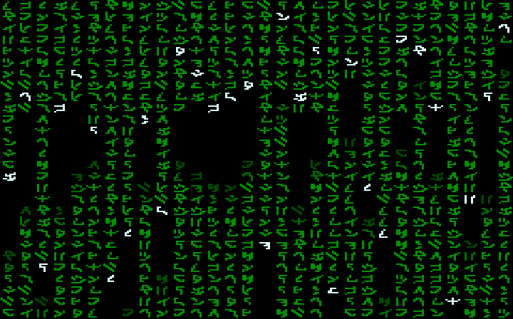

# uzematrix
A matrix screensaver for the Uzebox

This is a quick demo I wrote for the Uzebox. Basically, it simulates the classic “matrix” animation from The Matrix movies. You can see a screenshot below as well as the relatively simple implementation below.

